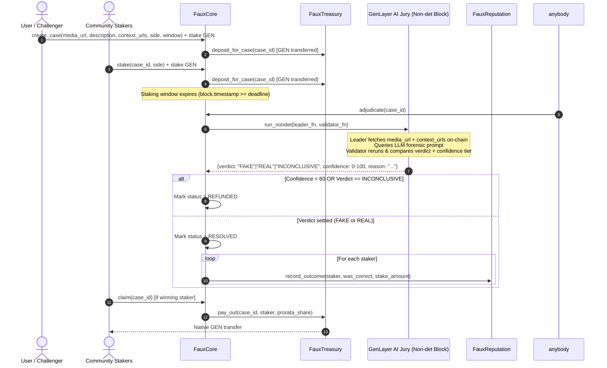

# Faux System Architecture

Faux is a neutral, decentralized deepfake bounty court built on **GenLayer studionet**.

## 1. Overview & Core Philosophy

Traditional moderation platforms (centralized social media, fact-checkers) suffer from opacity and single-point bias. Faux turns deepfake verification into a subjective consensus problem:
- **Community Staking:** Users put GEN tokens behind their belief (`CLAIM_FAKE` or `CLAIM_REAL`).
- **AI Jury Consensus:** GenLayer validators independently fetch multi-source web evidence and query LLMs on-chain without centralized oracles.
- **Optimistic Democracy:** Validator consensus ensures jury members evaluate the *meaning* (verdict and confidence tier) rather than superficial text string exactness.

---

## 2. Multi-Contract Architecture

To achieve high modularity and score maximum points on Contract Quality (Axis 2), Faux separates responsibilities into three distinct contracts:

```
                        +----------------------+
                        |      FauxCore        |
                        | (Cases, Adjudicate,  |
                        |   Stakes & Claims)   |
                        +----------+-----------+
                                   |
             +---------------------+---------------------+
             |                                           |
             v                                           v
+--------------------------+               +--------------------------+
|      FauxTreasury        |               |      FauxReputation      |
| (GEN custody, fee pool,  |               | (Staker accuracy stats,  |
|  payout emission)        |               |  leaderboard & history)  |
+--------------------------+               +--------------------------+
```

### Contract Responsibilities

1. **`FauxCore` (`faux_core.py`)**
   - Main entry point for user interactions.
   - Manages case state transitions (`OPEN` -> `ADJUDICATING` -> `RESOLVED` / `REFUNDED`).
   - Executes the non-deterministic AI jury block (`gl.nondet.web.render` + `gl.nondet.exec_prompt`).
   - Evaluates optimistic democracy consensus via `gl.vm.run_nondet(leader_fn, validator_fn)`.
   - Triggers payout commands to `FauxTreasury` and reputation updates to `FauxReputation`.

2. **`FauxTreasury` (`faux_treasury.py`)**
   - Holds escrowed GEN funds securely.
   - Accepts deposits forwarded from `FauxCore`.
   - Emits native GEN payouts via `gl.get_contract_at(recipient).emit_transfer(value=u256(amount))`.
   - Collects a 2% protocol fee into a dedicated treasury reserve.

3. **`FauxReputation` (`faux_reputation.py`)**
   - Tracks accuracy metrics (`correct_predictions`, `wrong_predictions`, `accuracy_bp`).
   - Maintains staker leaderboard data.
   - Provides public read-only views for user profiles and statistics.

---

## 3. Sequence Diagram — Case Adjudication Flow



---

## 4. Non-Deterministic Consensus Logic

The adjudication process follows GenLayer's Equivalence Principle pattern:

- **Leader Function (`leader_fn`):**
  1. Fetches content from the primary `media_url` and up to 3 `context_urls` using `gl.nondet.web.render(url, mode='text')`.
  2. Constructs a structured forensic prompt containing all gathered evidence snippets.
  3. Invokes `gl.nondet.exec_prompt` requesting JSON output: `{"verdict": "FAKE"|"REAL"|"INCONCLUSIVE", "confidence": <0-100>, "reason": "<explanation>"}`.

- **Validator Function (`validator_fn`):**
  1. Validates that the leader's return value is a valid `gl.vm.Return` object containing a dict.
  2. Re-runs `leader_fn()` using the validator's own LLM engine.
  3. **Checks Semantic Consensus:**
     - Compares `mine['verdict'] == leader['verdict']` (Exact match on the decision bucket).
     - Checks `abs(mine['confidence'] - leader['confidence']) <= 15` (Confidence level within acceptable tier).
     - **Ignores free-text differences in `reason`** so validators with varying phrasing still reach consensus.

---

## 5. Storage & Type Rules Applied

- **No bare `int` in persistent storage:** All monetary values use `bigint`. Bounded fields use `u8` or `u64`.
- **Dataclass decorators:** All custom struct types are decorated with `@allow_storage @dataclass`.
- **TreeMap keys as `str`:** All mapping keys use `str` (`_addr_str(address)`) to satisfy GenVM calldata boundary requirements.
- **No storage mutations in `__init__`:** Class fields are declared at class scope without re-instantiating `TreeMap()` or `DynArray()` inside `__init__`.
